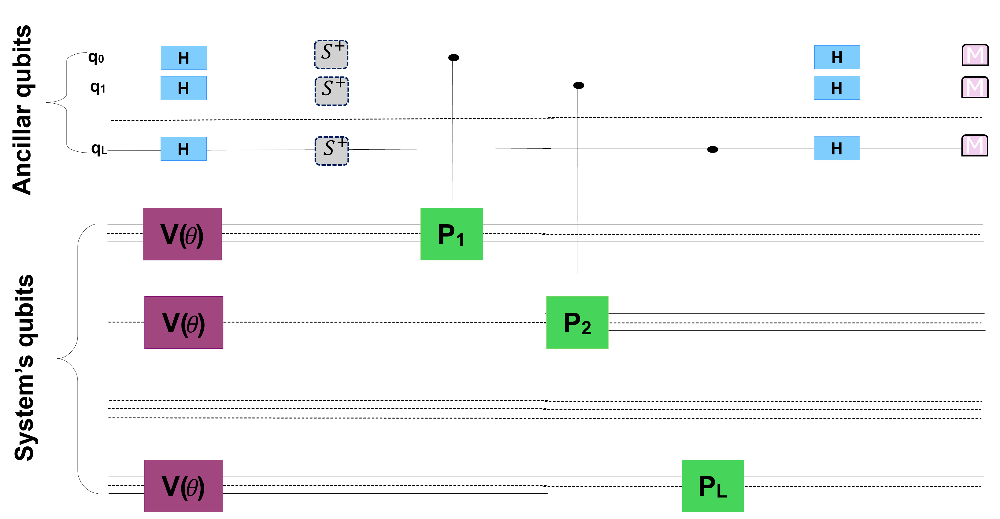

**Introduction**

In this notebook, we introduce a new variational quantum linear solver algorithm, with application to Poisson equation. This algorithm consists of employing the parallelism advantage that offers quantum computers to speedup the convergence to the target state( solution). Below is the detailed mathematics.

**Problem setup**

Let's assume that we want to solve a system of $N\times N$ linear equation ($N=2^n$, where $n$ is the number of qubits, $N$ the Hilbert space dimension), of the form:

$$
A\ket X =\ket b
$$

with $A$ a $2^n\times2^n$ matrix and $\ket X the solution vector. Our algorithm to solve this equation is described as follows:

- [x] From the system above we first construct a positive semi-definite operator **$H$** such that $H = \frac{1}{N}[A^\dagger(I_N - \ket b \bra b )A]$ or a local Hamiltonian following the work of Bravo et al  as $H = \frac{1}{N}[A^\dagger U_b(I_N - \sum_{k=0}^{n} \ket 0_k \bra 0_k \otimes I_{n-1} )U_b^\dagger A]$, where the normalisation condition $N$ is defined by $N = \bra X A^\dagger A \ket X$, and $U_b$ the unitary that prapares the vector $\ket b$. Further detail concerning these Hamiltonian operators can be found in \cite{bravo}.
- [x] Given that these Hamiltonian operators are not unitary they cannot be encoded with unitary gates in this form, thus, the next step is to make a unitary decomposition, i.e. rewrite the Hamiltanian as a linear combination of Pauli strings as $H = \sum_{k=1}^L \alpha_k P_k$, where $P_k$ are Pauli strings (a string contituted of Pauli operator) easy to encode with quantum gates, and $\alpha_k$ the coeaficients.
- [x] We define an objective function as $O = \bra{\Psi(\theta)}H\ket{\Psi(\theta)} = \sum_{k=1}^L \alpha_k  \bra{\Psi(\theta)}P_k\ket{\Psi(\theta)}$, where the argument $theta$ is an adjustable parameter and $\ket {\Psi(\theta)}$ a trial state, which should approximate the solution to the system of linear equation defined above if the adjustable parameters are found such that the objective function vanishes. It is important to notice that the objective function is build up following the advantage of a positive semi-definite Hamiltonian operator. This means we are looking for the ground state of that operator with prior knoledge that it has 0 ground state energy.
- [x]  Select a classical optimizer that help to smothly tune the paramters $\theta$ and minimize the objective function.

 The implementation with quantum gates is straitforward: (i) we choose an ancillar register with  $L$ qubits, and (ii) choose $L$ identical basis to measure the $L$ observables of the Hamiltonian operator. It is worth mentioning that the algorithm requires higher number of qubits as compared to existing ones, however, it takes fewer number of layered gates (less circuit depth). This is particularly important because lower circuit depth implies less noise or less decoherence, showing that the algorithm is efficient to implement under current noisy quantum hardwares. One can think that the number of qubits required is excessive for higher dimensional problem, having large number of Pauli strings but the algorithm offers the possibility to subdivide this into smaller block and then can be implemented on any current quantum hardware. Below is the circuit diagram:

<figure style="text-align:center">
  
  <figcaption>Figure 1: Quantum circuit diagram</figcaption>
</figure>
 
